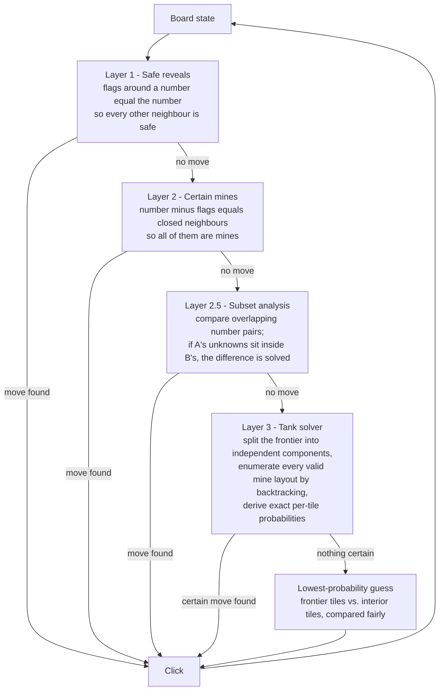
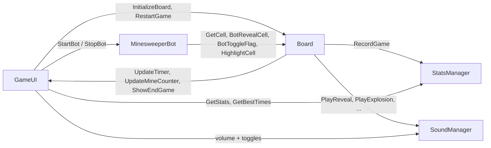

# Minesweeper

A complete, polished Minesweeper built in Unity 6 — with a **solver bot that plays the game for you using real constraint-satisfaction maths**, procedurally synthesised audio (zero audio files in the repo), persistent statistics, and a one-click browser build.

**▶ [Play it in your browser](https://emirsakal.github.io/Minesweeper/)** — no install, no download.

*[Türkçe README](README.tr.md)*

---

## What this project is

This is the classic Minesweeper, rebuilt from scratch rather than reskinned. Everything you see and hear is generated by code in this repository:

- The **grid, tiles and 3D bevel** are built at runtime from Unity UI primitives.
- The **sound effects and background music** are synthesised sample-by-sample at 44.1 kHz — there is not a single `.wav` or `.mp3` in the project.
- The **bot** is not scripted or random. It solves the board with the same logic a strong human player uses, and when logic runs out it computes the *exact* mine probability of every unknown tile and picks the safest one.

If you just want to see it work, [play the web build](https://emirsakal.github.io/Minesweeper/). If you want to see how it works, start with [`Assets/Scripts/MinesweeperBot.cs`](Assets/Scripts/MinesweeperBot.cs).

---

## Screenshots

<!--
  To add screenshots: drop the images in docs/screenshots/ and uncomment the block below.

  | Menu | In game | The bot solving | Statistics |
  |------|---------|-----------------|------------|
  |  |  |  |  |
-->

> Screenshots are not committed yet — the fastest way to see the game is the [live build](https://emirsakal.github.io/Minesweeper/), which loads in a browser tab.

---

## Features

### Gameplay

| | |
|---|---|
| **Three difficulties** | Easy 9×9 / 10 mines · Medium 16×16 / 40 mines · Hard 30×16 / 99 mines |
| **Safe first click** | Mines are placed *after* your first click, and the 3×3 area around it is guaranteed clear — you can never lose on move one |
| **Flood fill** | Clicking an empty tile opens the whole connected region, animated as an outward wave (BFS by depth, one wave every 0.04 s) with a scale-pop on each tile |
| **Flagging** | Right click on desktop, or a dedicated flag-mode toggle for touch devices |
| **Live HUD** | Remaining-mine counter and a `mm:ss` timer that starts on the first click |
| **Wrong-flag reveal** | On a loss the board opens up and shows which of your flags were wrong |

### The solver bot

Press **Bot** (or `B`) and the game plays itself, highlighting each tile it is about to click so you can follow its reasoning. It runs a four-layer decision pipeline and only ever guesses when the board is genuinely ambiguous.



The tank solver is the interesting part. It:

- classifies unknown tiles into **frontier** (adjacent to a revealed number) and **interior** (no information at all);
- builds one constraint per revealed number and uses **union-find** to split the frontier into independent components, so a 40-tile frontier becomes several small independent subproblems instead of one intractable one;
- **backtracks** through every valid mine assignment per component, ordering tiles most-constrained-first and pruning with incrementally maintained constraint state;
- counts how often each tile is a mine across all valid solutions to get its **exact probability**;
- falls back to a cheap heuristic for any component larger than 20 tiles or over 100 000 configurations, so it never hangs;
- when it has to guess, compares the best frontier tile against interior tiles using the *expected* number of mines left over, rather than naively assuming interior tiles are safer.

Rounds where the bot was used are tagged and **excluded from your statistics**, so the leaderboard stays honest.

### Statistics and progression

Tracked per difficulty and saved locally via `PlayerPrefs`:

- games played, games won, win rate
- current win streak and best-ever streak
- **top 5 fastest times**, with a "New record!" callout on the end-game screen
- a tabbed stats panel (Easy / Medium / Hard) with two-step confirmation before any reset

### Feel and polish

- **Fully procedural audio** — eight sound effects (reveal, sweep, flag, unflag, explosion, win, lose, button click) and a 45-second seamlessly looping ambient track, all generated as raw PCM at runtime. The music is deterministic (fixed RNG seed) so it sounds the same every session.
- **Context-aware mixing** — music ducks when a game starts and drops further on a win so the fanfare lands; volume changes crossfade rather than jump.
- **Audio settings** — separate music and SFX volume sliders plus on/off toggles, persisted between sessions. The sound manager survives scene reloads (`DontDestroyOnLoad` singleton), so a restart doesn't restart the music.
- **Screen shake** on detonation — 0.5 s, amplitude decaying from 8 px to 0.
- **UI confetti** on a win — three waves of 22 pieces, each falling at its own speed, swaying, spinning and fading out.
- **Custom typography** — a dedicated `mine-sweeper` display face for numbers, Poppins for the interface, both as SDF assets.
- **Classic Minesweeper look** — bevelled closed tiles, a sunken inset panel behind the grid, and the traditional 1–8 number colour scheme.

### Controls

| Input | Action |
|---|---|
| Left click | Reveal a tile |
| Right click | Place / remove a flag |
| Flag-mode button | Switch left click to flagging — for touch devices |
| `R` | Restart |
| `B` | Start / stop the bot |
| `F` | Toggle flag mode |

Keyboard shortcuts are ignored while the menu, stats or settings panel is open.

---

## Tech stack

| | |
|---|---|
| **Engine** | Unity `6000.2.10f1` (Unity 6.2) |
| **Render pipeline** | Universal RP 17.2.0 |
| **UI** | Unity UI (uGUI) + TextMeshPro — the entire board is Canvas-based, not world-space sprites |
| **Input** | Input System 1.14.2, project configured for *Both* (new + legacy) |
| **Language** | C#, no third-party runtime dependencies |
| **Target** | WebGL (shipped), plus any standard Unity platform |

## Project structure

```
Assets/
├─ Scenes/Game.unity          Single scene — menu, game and all panels live here
├─ Scripts/
│  ├─ Board.cs                (1139 ln) Grid state, mine placement, flood fill,
│  │                                    win/lose, tile rendering, shake, confetti
│  ├─ MinesweeperBot.cs        (803 ln) Four-layer solver incl. the tank solver
│  ├─ SoundManager.cs          (596 ln) Procedural SFX + music synthesis, mixing,
│  │                                    persistence; DontDestroyOnLoad singleton
│  ├─ GameUI.cs                (494 ln) Menu, HUD, end-game, stats and settings
│  │                                    panels; keyboard shortcuts
│  ├─ StatsManager.cs          (146 ln) PlayerPrefs-backed per-difficulty stats
│  ├─ Cell.cs                   (26 ln) Plain data model for one tile
│  └─ GridInputHandler.cs       (22 ln) Right-click routing for the Canvas grid
└─ Art/                       Fonts (mine-sweeper, Poppins) and UI sprites

docs/                         Committed WebGL build, served by GitHub Pages
PROJECT_IDEAS.md              Backlog of planned features
```

Architecture in one line: `Board` owns game state and rendering, `GameUI` owns every panel and is wired to scene objects through `SerializeField` references, `MinesweeperBot` reads the board through its public query API and drives it through `BotRevealCell` / `BotToggleFlag`, and `StatsManager` / `SoundManager` are stateless-ish services either side.



---

## Running it

### Play without installing anything

Open **<https://emirsakal.github.io/Minesweeper/>**.

### Open the project

1. Install **Unity 6000.2.10f1** (Unity Hub → Installs → Add → matching version).
2. Clone the repo:
   ```bash
   git clone https://github.com/emirsakal/Minesweeper.git
   ```
3. Add the folder in Unity Hub and open it. First import takes a few minutes while the Library is rebuilt.
4. Open `Assets/Scenes/Game.unity` and press Play.

### Build for the web

`File → Build Settings → WebGL → Build`, output to `docs/`. GitHub Pages serves that folder directly, so committing the build is all the deployment there is.

> **Note:** GitHub Pages is currently configured to serve `/docs` from the `claude/minesweeper-game-setup-Nwobh` branch. Now that everything is merged, switch it to `main` under *Settings → Pages*.

---

## Roadmap

[`PROJECT_IDEAS.md`](PROJECT_IDEAS.md) holds the full backlog. The nearest items:

- **Custom boards** — player-defined width, height and mine count
- **Chording** — click a satisfied number to open all its neighbours at once
- **Hint system** — surface one guaranteed-safe tile on request
- **Probability overlay** — render the tank solver's per-tile numbers as a heatmap
- **Seeded boards** and a **daily challenge** built on them
- **Play-mode tests** for mine placement, flood fill, win detection and each bot layer

---

## Credits

- Interface font: [Poppins](https://fonts.google.com/specimen/Poppins) (Indian Type Foundry)
- Number font: `mine-sweeper`
- Everything else — code, audio synthesis, board rendering, solver — written for this project.
