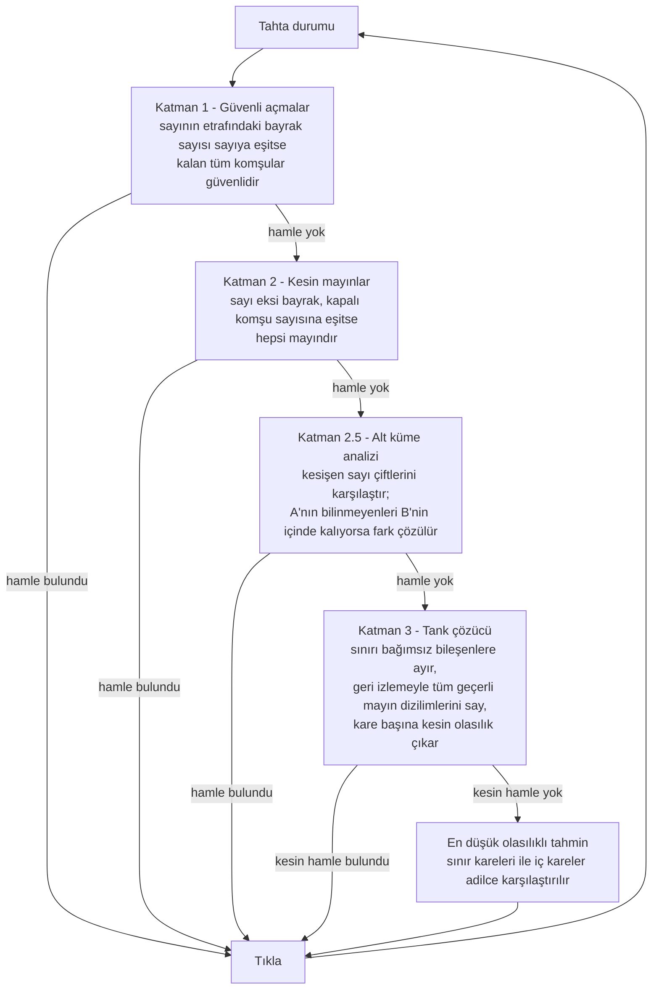
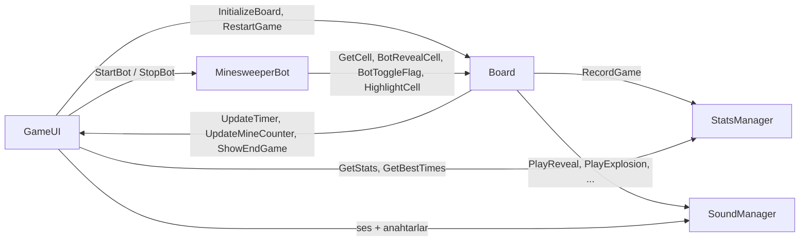

# Mayın Tarlası (Minesweeper)

Unity 6 ile sıfırdan yazılmış, tamamlanmış bir Mayın Tarlası oyunu — **oyunu gerçek kısıt-çözümleme matematiğiyle senin yerine oynayan bir çözücü bot**, kod tarafından üretilen ses efektleri ve müzik (projede tek bir ses dosyası yok), kalıcı istatistikler ve tek tıkla açılan tarayıcı sürümü.

**▶ [Tarayıcıda hemen oyna](https://emirsakal.github.io/Minesweeper/)** — kurulum yok, indirme yok.

*[English README](README.md)*

---

## Bu proje nedir?

Klasik Mayın Tarlası, hazır bir şablonun üzerine giydirilmiş değil, baştan yazılmış hâli. Gördüğün ve duyduğun her şey bu depodaki kod tarafından üretiliyor:

- **Izgara, kareler ve 3B kabartma efekti** çalışma anında Unity UI parçalarından kuruluyor.
- **Ses efektleri ve fon müziği** 44.1 kHz'de örnek örnek sentezleniyor — projede tek bir `.wav` veya `.mp3` yok.
- **Bot** ne senaryolu ne de rastgele. Tahtayı iyi bir insan oyuncunun kullandığı mantıkla çözüyor; mantık tükendiğinde her bilinmeyen karenin **kesin mayın olasılığını** hesaplayıp en güvenlisini seçiyor.

Sadece çalışırken görmek istiyorsan [web sürümünü aç](https://emirsakal.github.io/Minesweeper/). Nasıl çalıştığını merak ediyorsan [`Assets/Scripts/MinesweeperBot.cs`](Assets/Scripts/MinesweeperBot.cs) dosyasından başla.

---

## Ekran görüntüleri

<!--
  Ekran görüntüsü eklemek için: görselleri docs/screenshots/ klasörüne koy ve aşağıdaki bloğun yorumunu kaldır.

  | Menü | Oyun içi | Bot oynarken | İstatistikler |
  |------|----------|--------------|---------------|
  |  |  |  |  |
-->

> Ekran görüntüleri henüz eklenmedi — oyunu görmenin en hızlı yolu tarayıcıda açılan [canlı sürüm](https://emirsakal.github.io/Minesweeper/).

---

## Özellikler

### Oynanış

| | |
|---|---|
| **Üç zorluk** | Kolay 9×9 / 10 mayın · Orta 16×16 / 40 mayın · Zor 30×16 / 99 mayın |
| **Güvenli ilk tık** | Mayınlar ilk tıktan *sonra* yerleştirilir ve tıkladığın karenin 3×3 çevresi kesinlikle temiz olur — ilk hamlede kaybetmek imkânsız |
| **Otomatik açılma (flood fill)** | Boş bir kareye tıklayınca bağlı tüm bölge açılır; dışa doğru yayılan dalga animasyonuyla (derinliğe göre BFS, her 0,04 sn'de bir dalga) ve her karede küçük bir ölçek sıçramasıyla |
| **Bayraklama** | Masaüstünde sağ tık, dokunmatik cihazlarda özel bayrak modu düğmesi |
| **Canlı HUD** | Kalan mayın sayacı ve ilk tıkla başlayan `dk:sn` biçiminde kronometre |
| **Yanlış bayrak gösterimi** | Kaybedince tahta açılır ve hangi bayrakların yanlış olduğu işaretlenir |

### Çözücü bot

**Bot** düğmesine (veya `B`) bas, oyun kendi kendine oynasın. Tıklayacağı kareyi önceden vurguladığı için düşünme sürecini adım adım izleyebilirsin. Dört katmanlı bir karar hattı çalıştırır ve yalnızca tahta gerçekten belirsizse tahmin yürütür.



İşin asıl ilginç kısmı tank çözücü. Şunları yapıyor:

- kapalı kareleri **sınır** (açılmış bir sayıya komşu) ve **iç** (hakkında hiç bilgi yok) olarak ayırıyor;
- her açılmış sayı için bir kısıt kuruyor ve **union-find** ile sınırı bağımsız bileşenlere bölüyor; böylece 40 karelik bir sınır, çözülemez tek bir problem yerine birkaç küçük bağımsız alt probleme dönüşüyor;
- her bileşen için geçerli tüm mayın dizilimlerini **geri izleme (backtracking)** ile tarıyor; kareleri en çok kısıtlanandan başlayarak sıralayıp artımlı kısıt durumuyla budama yapıyor;
- her karenin geçerli çözümlerin kaçında mayın çıktığını sayarak **kesin olasılığını** buluyor;
- 20 kareden büyük veya 100.000 dizilimi aşan bileşenlerde ucuz bir sezgisele düşüyor, yani hiçbir zaman kilitlenmiyor;
- tahmin etmek zorunda kaldığında, iç kareleri "nasılsa daha güvenlidir" diye varsaymak yerine geriye kalan **beklenen** mayın sayısını hesaba katarak en iyi sınır karesiyle karşılaştırıyor.

Botun kullanıldığı turlar işaretlenir ve **istatistiklere dahil edilmez**, böylece rekor tablosu dürüst kalır.

### İstatistikler ve ilerleme

Zorluk bazında tutulur ve `PlayerPrefs` ile cihazda saklanır:

- oynanan oyun, kazanılan oyun, kazanma oranı
- güncel galibiyet serisi ve tüm zamanların en iyi serisi
- **en hızlı 5 süre**, yeni rekorda oyun sonu ekranında "Yeni Rekor!" vurgusu
- sekmeli istatistik paneli (Kolay / Orta / Zor) ve sıfırlama öncesi iki adımlı onay

### His ve cila

- **Tamamen prosedürel ses** — sekiz efekt (açma, süpürme, bayrak, bayrak kaldırma, patlama, kazanma, kaybetme, düğme tıklaması) ve 45 saniyelik kusursuz döngüye giren bir ambiyans parçası, hepsi çalışma anında ham PCM olarak üretiliyor. Müzik sabit bir rastgelelik tohumu kullandığı için her açılışta aynı duyuluyor.
- **Bağlama duyarlı miks** — oyun başlayınca müzik geri çekiliyor, kazanınca daha da kısılıyor ki zafer sesi öne çıksın; ses değişimleri sıçramıyor, yumuşak geçiyor.
- **Ses ayarları** — müzik ve efektler için ayrı ses seviyesi kaydırıcıları ve aç/kapa anahtarları, oturumlar arasında saklanıyor. Ses yöneticisi sahne yeniden yüklense de yaşamaya devam ettiği için (`DontDestroyOnLoad` singleton) yeniden başlatmak müziği baştan sarmıyor.
- **Ekran sarsıntısı** — patlamada 0,5 saniye, genliği 8 pikselden 0'a sönümlenerek.
- **Konfeti** — kazanınca üç dalga hâlinde 22'şer parça; her biri kendi hızında düşüp savrularak dönüyor ve soluklaşarak kayboluyor.
- **Özel tipografi** — sayılar için `mine-sweeper` yazı tipi, arayüz için Poppins; ikisi de SDF varlığı olarak.
- **Klasik görünüm** — kabartmalı kapalı kareler, ızgaranın arkasında içe gömük panel ve geleneksel 1–8 sayı renkleri.

### Kontroller

| Girdi | İşlev |
|---|---|
| Sol tık | Kare aç |
| Sağ tık | Bayrak koy / kaldır |
| Bayrak modu düğmesi | Sol tıkı bayraklamaya çevirir — dokunmatik cihazlar için |
| `R` | Yeniden başlat |
| `B` | Botu başlat / durdur |
| `F` | Bayrak modunu değiştir |

Menü, istatistik veya ayarlar paneli açıkken klavye kısayolları devre dışıdır.

---

## Teknoloji

| | |
|---|---|
| **Motor** | Unity `6000.2.10f1` (Unity 6.2) |
| **Render hattı** | Universal RP 17.2.0 |
| **Arayüz** | Unity UI (uGUI) + TextMeshPro — tahtanın tamamı Canvas tabanlı, dünya uzayı sprite'ları değil |
| **Girdi** | Input System 1.14.2, proje *Both* (yeni + eski) olarak yapılandırılmış |
| **Dil** | C#, çalışma anında üçüncü parti bağımlılık yok |
| **Hedef** | WebGL (yayında), ayrıca standart tüm Unity platformları |

## Proje yapısı

```
Assets/
├─ Scenes/Game.unity          Tek sahne — menü, oyun ve tüm paneller burada
├─ Scripts/
│  ├─ Board.cs               (1139 sr) Izgara durumu, mayın yerleşimi, flood fill,
│  │                                   kazanma/kaybetme, kare çizimi, sarsıntı, konfeti
│  ├─ MinesweeperBot.cs       (803 sr) Tank çözücü dahil dört katmanlı çözücü
│  ├─ SoundManager.cs         (596 sr) Prosedürel efekt + müzik sentezi, miks,
│  │                                   kalıcılık; DontDestroyOnLoad singleton
│  ├─ GameUI.cs               (494 sr) Menü, HUD, oyun sonu, istatistik ve ayar
│  │                                   panelleri; klavye kısayolları
│  ├─ StatsManager.cs         (146 sr) PlayerPrefs tabanlı zorluk bazlı istatistik
│  ├─ Cell.cs                  (26 sr) Tek karenin veri modeli
│  └─ GridInputHandler.cs      (22 sr) Canvas ızgarasında sağ tık yönlendirmesi
└─ Art/                       Yazı tipleri (mine-sweeper, Poppins) ve arayüz görselleri

docs/                         Depoya işlenmiş WebGL derlemesi, GitHub Pages buradan yayınlıyor
PROJECT_IDEAS.md              Planlanan özelliklerin listesi
```

Mimari tek cümlede: `Board` oyun durumunu ve çizimi tutar, `GameUI` tüm panelleri sahiplenir ve sahne nesnelerine `SerializeField` referanslarıyla bağlanır, `MinesweeperBot` tahtayı genel sorgu API'si üzerinden okuyup `BotRevealCell` / `BotToggleFlag` ile sürer, `StatsManager` ve `SoundManager` ise iki yanda duran servislerdir.



---

## Çalıştırma

### Hiçbir şey kurmadan oyna

**<https://emirsakal.github.io/Minesweeper/>** adresini aç.

### Projeyi aç

1. **Unity 6000.2.10f1** sürümünü kur (Unity Hub → Installs → Add → aynı sürüm).
2. Depoyu klonla:
   ```bash
   git clone https://github.com/emirsakal/Minesweeper.git
   ```
3. Klasörü Unity Hub'a ekleyip aç. İlk açılışta Library yeniden oluşturulduğu için birkaç dakika sürer.
4. `Assets/Scenes/Game.unity` sahnesini aç ve Play'e bas.

### Web için derle

`File → Build Settings → WebGL → Build`, çıktı klasörü `docs/`. GitHub Pages bu klasörü doğrudan yayınladığı için derlemeyi commit'lemek dağıtım için yeterli.

> **Not:** GitHub Pages şu anda `/docs` klasörünü `claude/minesweeper-game-setup-Nwobh` dalından yayınlıyor. Her şey `main`'e birleştirildiğine göre *Settings → Pages* altından kaynağı `main` olarak değiştirmek gerekiyor.

---

## Yol haritası

Tüm liste [`PROJECT_IDEAS.md`](PROJECT_IDEAS.md) dosyasında. En yakın maddeler:

- **Özel tahta** — oyuncunun belirlediği genişlik, yükseklik ve mayın sayısı
- **Chord** — sayısı tamamlanmış kareye tıklayınca tüm komşuları tek seferde açma
- **İpucu sistemi** — istendiğinde kesin güvenli bir kare gösterme
- **Olasılık katmanı** — tank çözücünün kare başına değerlerini ısı haritası olarak çizme
- **Tohumlu tahtalar** ve bunun üzerine kurulu **günlük görev**
- Mayın yerleşimi, flood fill, kazanma tespiti ve her bot katmanı için **play-mode testleri**

---

## Teşekkür

- Arayüz yazı tipi: [Poppins](https://fonts.google.com/specimen/Poppins) (Indian Type Foundry)
- Sayı yazı tipi: `mine-sweeper`
- Geri kalan her şey — kod, ses sentezi, tahta çizimi, çözücü — bu proje için yazıldı.
